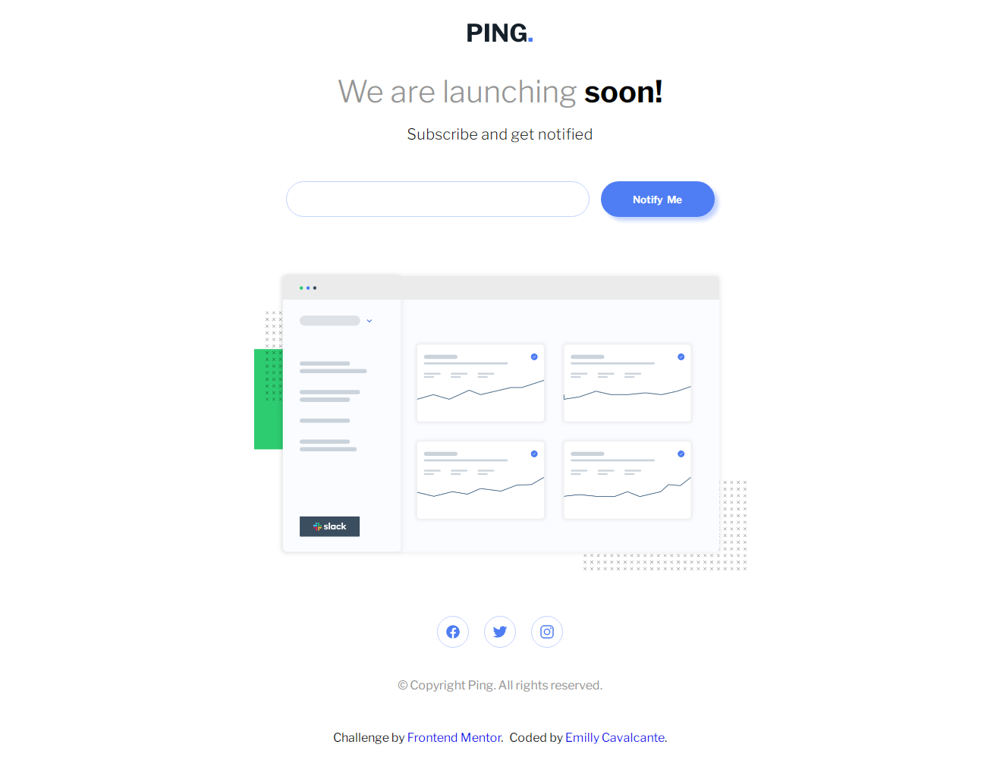
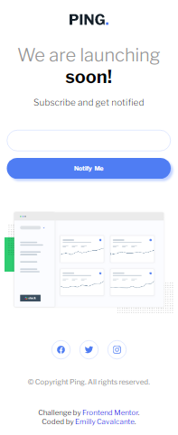

# Ping Coming Soon Page

## Visão Geral

Página responsiva de "em breve" com sistema de captura e validação de email, desenvolvida como solução para desafio de front-end proposto pela Frontend Mentor. O site implementa boas práticas de UX/UI e acessibilidade, oferecendo feedback visual claro para o usuário.

## Funcionalidades

- Validação de email: Verifica se o campo está vazio ou se o formato está incorreto
- Responsividade: Adaptação automática para desktop, tablet e mobile
- Feedback visual: Estados de hover e mensagens de erro claras

## Especificações Técnicas

### Tecnologias Utilizadas
- HTML5
- CSS3
- JavaScript ES6+

### Validações Implementadas

| Cenário | Mensagem de Erro |
|---------|------------------|
| Campo vazio | "Whoops! It looks like you forgot to add your email" |
| Formato inválido | "Please provide a valid email address" |

## Demonstração

### Preview

### Links
- **Demonstração**: [Visualizar projeto](https://seu-link-aqui.com)
- **Código fonte**: [Repositório GitHub](https://github.com/httpsemilly/ping-coming-soon-page)

## Considerações de Desenvolvimento

Este projeto demonstra a implementação de:
- Formulários acessíveis com validação client-side
- Design responsivo seguindo princípios de mobile-first
- Tratamento adequado de estados de erro e de sucesso
- Código limpo e bem estruturado para manutenibilidade

## Licença
Este projeto está licenciado sob a MIT License.

## Autor

- GitHub: [@httpsemilly](https://github.com/httpsemilly)
- LinkedIn: [Emilly Cavalcante](https://linkedin.com/emillycavalcante)
- Email: emilly.menezescs@gmail.com

---

